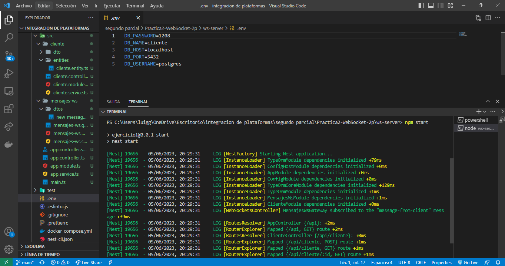
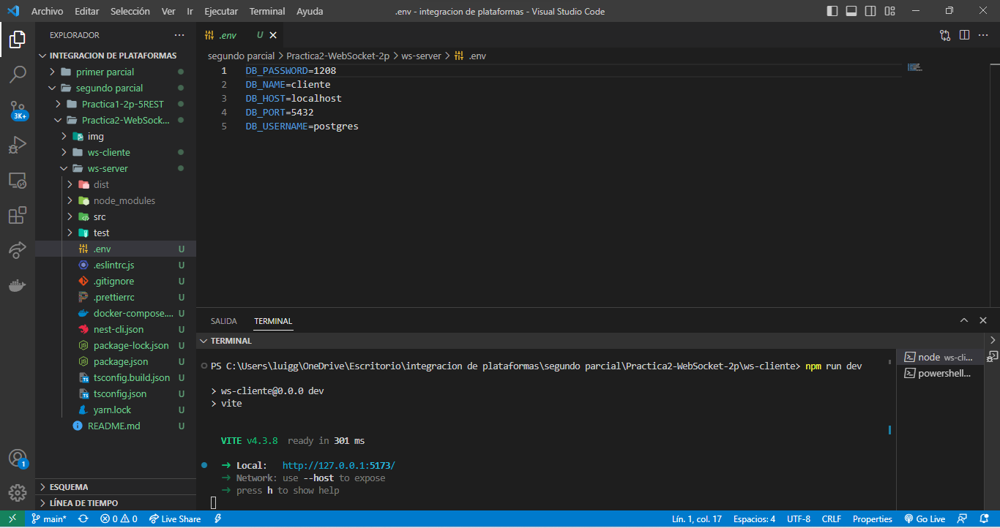

para la ejecucion del server:   npm start

para la ejecucion del cliente utilizar:   npm run dev

Entidades utilizadas:

Se creó el usurio(deportista) el cual podrá interctuar con el socket, genernando su propio ID
 

Dentro del socket se escribe del nombre del usuario antes asignado y se da al botón "conectar" 

Una vez se haya identificado el usuario, se podrán enviar mensajes y ser recibidos en la base de datos, como se muestra a continuación:

NOTA: se utlizó una base de datos local propia ya que la compartida en clases estaba generando conflictos.

