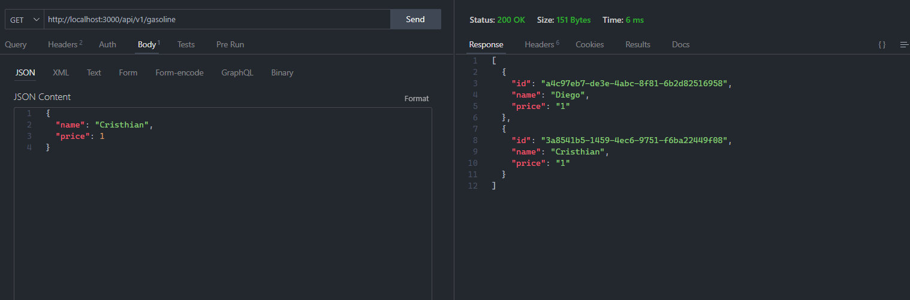
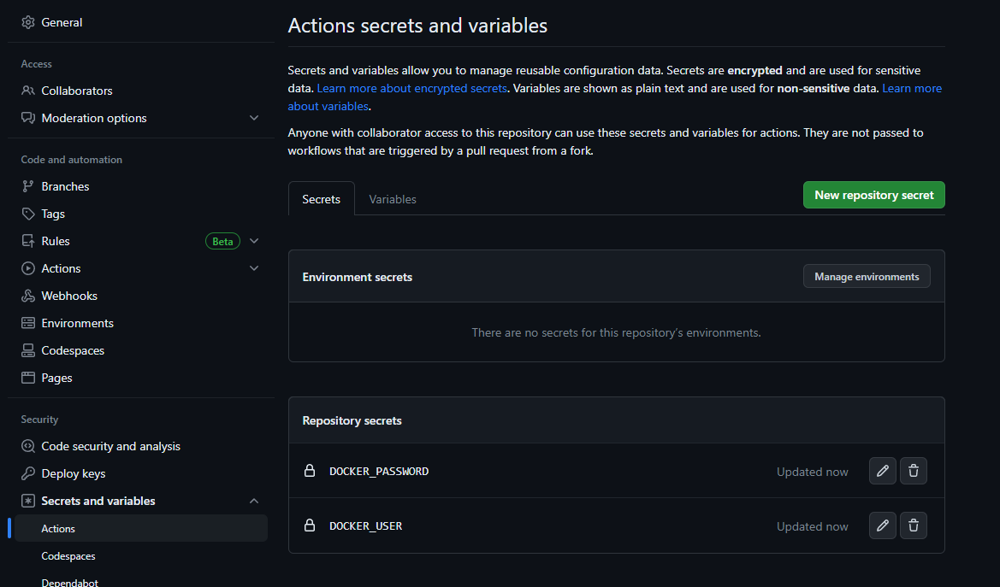
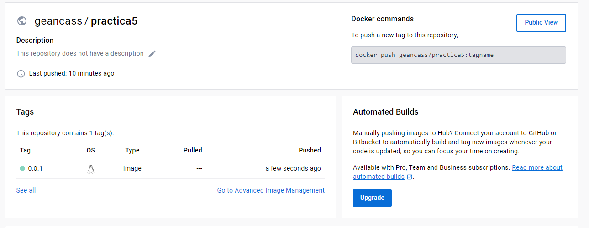
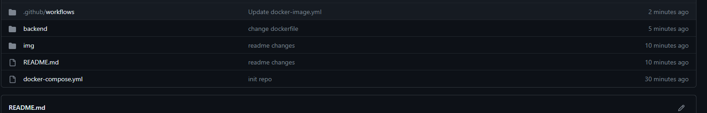
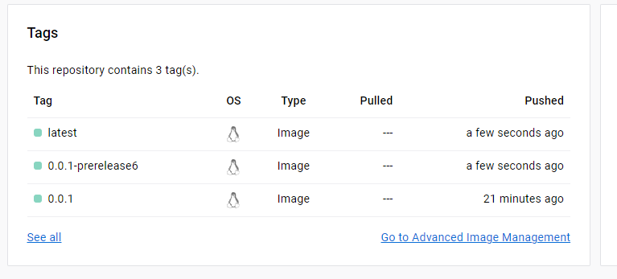

# PRACTICA 5

- Comprobación de que funciona la api correctamente.

- Creado los secret correctamente.

- Imagen de docker subida a docker hub.

- Creado el workflow tipo docker

- Comprobando que el workflow funciona correctamente.

- Comprobando docker hub.

